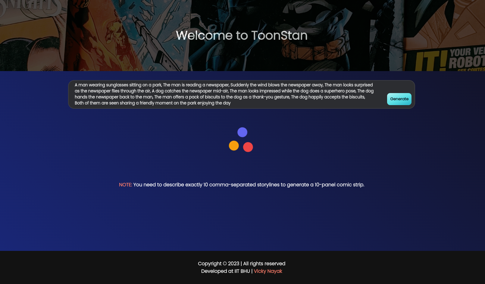
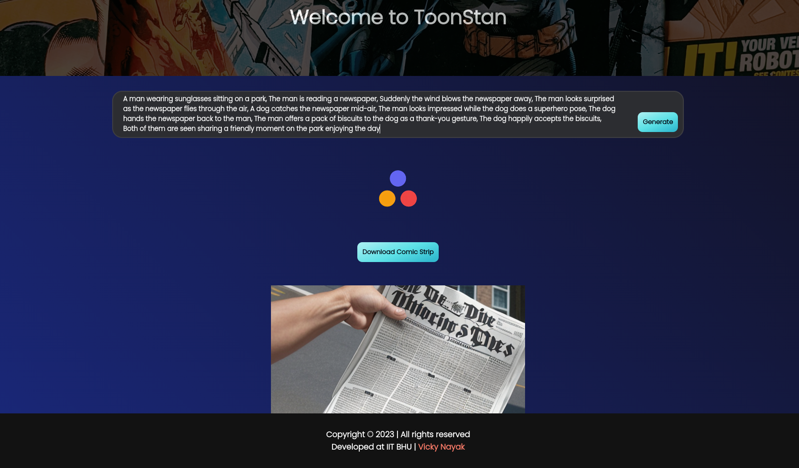

# ToonStan - Comic Creator Web App

Create, download, and share your own 10-panel comic strips with ease using this React.js-based web application!

### Getting Started

Clone the Repository:

```
https://github.com/Vickyknk07/ToonStan.git
```

Navigate to the Project Directory:

```
cd ToonStan
```

Install Dependencies:

```
npm install
```

Start the Development Server:

```
npm start
```

### Deployment Site

Check out the deployed site at [vicky.iitbhu.tech](https://vicky.iitbhu.tech)

### Features

- **User-Friendly UI**: Intuitive and easy-to-use interface built with React.js.
- **Comic Strip Generation**: Input comma-separated text to generate a 10-panel comic strip.
- **Responsive Design**: Ensures a seamless experience on both desktop and mobile browsers.
- **Text Annotations**: Text annotations on the comic strip panels for a personalized touch.

### Screenshots




### Demo Input Text

A man wearing sunglasses sitting on a park, The man is reading a newspaper, Suddenly the wind blows the newspaper away, The man looks surprised as the newspaper flies through the air, A dog catches the newspaper mid-air, The man looks impressed while the dog does a superhero pose, The dog hands the newspaper back to the man, The man offers a pack of biscuits to the dog as a thank-you gesture, The dog happily accepts the biscuits, Both of them are seen sharing a friendly moment on the park enjoying the day